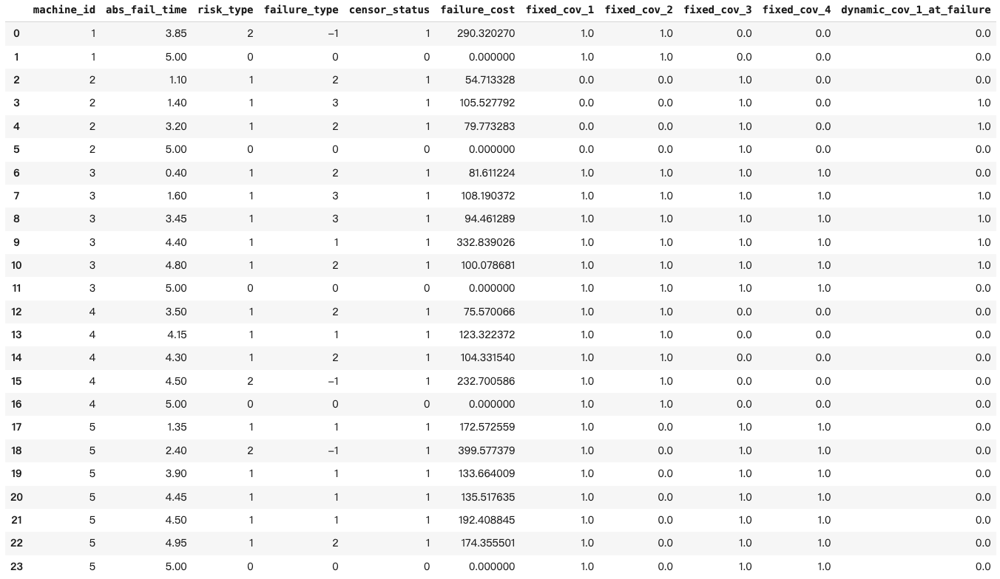

# Simulation-Engines-for-Maintenance-Events-in-Heterogeneous-Machines

Recent studies in reliability increasingly rely on data-driven algorithms, such as machine/deep learning, which require large amounts of failure and maintenance data for training and validation. However, such historical data are often scarce in industrial practice, limiting the development and evaluation of these methods. To address this limitation, this study develops two feature-dependent simulation engines that generate realistic degradation and maintenance datasets under both time-based (TBM) and condition-based maintenance (CBM) frameworks.

The TBM engine simulates maintenance event logs for industrial equipment over predefined observation periods. Failures are modeled as a non-homogeneous Poisson process with competing failure types, while machine-specific features are incorporated through a proportional hazards structure to capture their influence on failure behavior. The model also considers the impact of imperfect preventive maintenance on subsequent failure occurrences. For each unit, the simulation generates a sequence of preventive and corrective maintenance events, including their timing, type, and associated costs.

The CBM engine focuses on degradation-path simulation. It generates stochastic degradation processes—including Gamma, Wiener, and compound Poisson models—and captures machine heterogeneity and feature-driven effects through static and dynamic covariates. Observed degradation indicators are generated by introducing measurement noise to latent degradation levels, and preventive maintenance is scheduled according to the specified maintenance policy. Maintenance costs are modeled using a transparent, type-specific framework, enabling analysis of cost structures for different maintenance actions. The engine produces degradation paths and maintenance event logs for multiple units.

These simulators were developed within the Flanders Make CostLeap Project to provide a flexible environment that facilitates data-driven decision-making in maintenance planning, service provision, and lifecycle cost management.

## ⚙️ Two Simulation Engines
### 1️⃣ Time-Based Maintenance (TBM) Engine
The TBM engine simulates maintenance event logs under periodic PM policies, allowing each machine to have its own PM interval.

It generates:
- Failure times
- Failure types (minor vs. catastrophic)
- Corrective & preventive maintenance events
- Maintenance costs

The following figure shows an example TBM output: a log table containing maintenance events and their associated features.



A detailed explanation of the TBM engine can be found in:
📄 TBM_Note.pdf

### 2️⃣ Condition-Based Maintenance (CBM) Engine
The CBM engine simulates degradation trajectories and maintenance actions triggered by:
- observed degradation reaching a PM threshold,
- scheduled periodic intervals, or
- both (combined time-and-level-based policy).

Each machine can be assigned a unique maintenance policy, including its own PM threshold and PM interval.

It generates:
- Degradation trajectories (latent and observed)
- Perfect PM, imperfect PM, and CM events with cost models
- Event logs, including timestamps, event types, trigger mechanisms, pre-/post-repair states, repair effectiveness, and costs

The following figure shows examples of the degradation paths generated by the CBM engine.


A detailed description of the CBM simulator is provided in:

📄 CBM_Note.pdf


## 📁 Repository Structure
```
condition_based/
    ├── covariates.py
    ├── degradation.py
    ├── repair.py
    ├── cost.py
    ├── single_machine_sim.py
    ├── multi_machine_sim.py

time_based/
    ├── hazard.py
    ├── failure_type.py
    ├── cost.py
    ├── simulation.py

run_tbm_example.py
run_cbm_example.py
README.md
```

## 👥 Authors

**Yue Cai**  
Research Center for Operations Management, KU Leuven, Belgium  
Flanders Make@KU Leuven, Leuven, Belgium  

**Robert Boute**  
Research Center for Operations Management, KU Leuven, Belgium  
Flanders Make@KU Leuven, Leuven, Belgium  
Technology and Operations Management Area, Vlerick Business School, Leuven, Belgium  

**Laurens Deprez**  
Research Center for Operations Management, KU Leuven, Belgium  

## 🏛 Project Background

This simulation engine is developed as part of the **Flanders Make *CostLeap* Project**, a collaboration between:

- **KU Leuven** — Operations Management Research Group  
- **Flanders Make** — Strategic Research Centre for the Manufacturing Industry  
- **UGent**  

## 📫 Contact

For questions, collaboration, or feedback, please contact:  
📧 **yue.cai@kuleuven.be**
